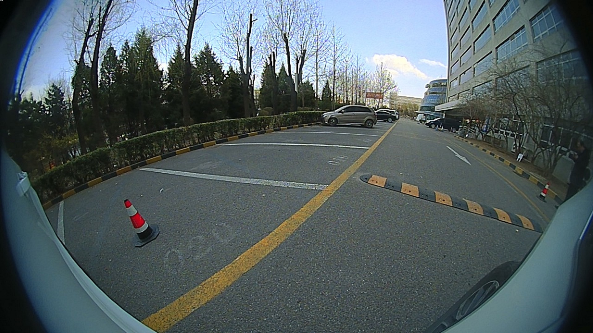
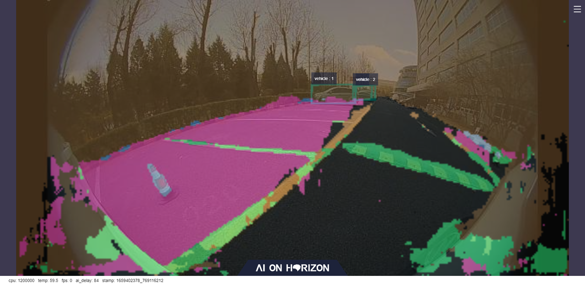

# 功能介绍

parking_perception package 是基于 hobot_dnn package开发的室外停车区域检测算法示例，基于地平线推出的多任务推理模型，在地平线的旭日X3派上使用停车区域检测模型和室内数据利用BPU进行模型推理，从而得到AI推理结果。
本package支持直接订阅sensors/msg/Image类型的话题，并且支持读取本地图片的形式进行推理，将AI信息通过话题发布的同时会将结果在Web页面渲染可视化，同时支持渲染图片保存在程序运行的result目录。

多任务模型同时支持语义分割和目标检测。
算法支持的语义分割类别如下：
```
1. 道路
2. 背景
3. 车道线
4. 标志线
5. 车位线
6. 车位区域
7. 停车杆
8. 停车地锁
```

算法支持的目标检测类别如下：

```
1. 骑车人
2. 行人
3. 车后背
4. 汽车
5. 停车地锁
```
每个类别包含长、宽、类别等信息。package对外发布包含语义分割和目标检测信息的AI Msg，用户可以订阅发布的AI Msg用于应用开发。
完整的AI Msg描述如下所示：

````
# 分割消息
Capture[] captures
数据结构：
std::vector<float> features

# 分割类型名称，如：道路、背景、车道线、标志线、车位线、车位区域、停车杆、停车地锁
# road/background/lane_marking/sign_line/parking_lane/parking_space/parking_rod/parking_lock

# 检测消息
Roi[] rois
数据结构：
std::string type
int rect.x_offset
int rect.y_offset
int rect.width
int rect.height

# 检测类型名称，如：骑车人、行人、车后背、汽车、停车地锁
# cyclist/person/rear/vehicle/parkinglock

````

# 编译

## 依赖库


ros package：

- dnn_node
- ai_msgs
- OpenCV

dnn_node是在地平线旭日X3开发板上利用BPU处理器进行模型推理的package，定义在hobot_dnn中。

ai_msgs为自定义的消息格式，用于算法模型推理后，发布推理结果，ai_msgs package定义在hobot_msgs中。

OpenCV用于图像处理。

## 开发环境

- 编程语言: C/C++
- 开发平台: X3/X86
- 系统版本：Ubuntu 20.0.4
- 编译工具链:Linux GCC 9.3.0/Linaro GCC 9.3.0

## 编译

 支持在X3 Ubuntu系统上编译和在PC上使用docker交叉编译两种方式。

### 编译选项

1. SHARED_MEM
   - 零拷贝传输方式使能开关，默认打开(ON), 编译时可以通过--cmake-args -DSHARED_MEM=OFF关闭。
   - 如果打开，编译会依赖hbm_img_msgs package，并且需要使用tros进行编译。
   - 如果关闭，编译和运行不依赖hbm_img_msgs pkg，支持使用原生ros和tros进行编译。
   - 对于零拷贝通信方式，当前只支持订阅nv12格式图片。

### Ubuntu板端编译

1. 编译环境确认 
   - 板端已安装X3 Ubuntu系统。
   - 当前编译终端已设置TogetherROS环境变量：`source PATH/setup.bash`。其中PATH为TogetherROS的安装路径。
   - 已安装ROS2编译工具colcon，安装命令：`pip install -U colcon-common-extensions`
2. 编译

 编译命令：`colcon build --packages-select parking_perception`

### Docker交叉编译

1. 编译环境确认

   - 在docker中编译，并且docker中已经安装好TogetherROS。docker安装、交叉编译说明、TogetherROS编译和部署说明详见机器人开发平台robot_dev_config repo中的README.md。

2. 编译

   - 编译命令：

```
export TARGET_ARCH=aarch64
export TARGET_TRIPLE=aarch64-linux-gnu
export CROSS_COMPILE=/usr/bin/$TARGET_TRIPLE-

colcon build --packages-select parking_perception \
   --merge-install \
   --cmake-force-configure \
   --cmake-args \
   --no-warn-unused-cli \
   -DCMAKE_TOOLCHAIN_FILE=`pwd`/robot_dev_config/aarch64_toolchainfile.cmake
```

## 注意事项

# 使用介绍

## 依赖

- parking_perception package：发布2D检测和分割信息

## 相机输入

- image_width: 640
- image_height: 320

## 参数

| 参数名                 | 类型        | 解释                                        | 是否必须 | 支持的配置           | 默认值                        |
| ---------------------- | ----------- | ------------------------------------------- | -------- | -------------------- | ----------------------------- |
| ai_msg_pub_topic_name  | std::string | 发布包含检测结果的AI消息的topic名 | 否      | 根据实际部署环境配置 | /ai_msg_parking_perception |
| image_sub_topic_name | std::string | 订阅ROS2消息列表中的topic名 | 否 | 根据实际部署环境配置 | /image_raw |
| dump_render_img | int | 是否保存渲染图片到本地 | 否 | 保存在 ”result“ 目录 | 0 |
| shared_mem  | int | 是否使用shared mem通信方式订阅图片消息。0：关闭；1：打开。打开和关闭shared mem通信方式订阅图片的topic名分别为/hbmem_img和/image_raw | 否      | 0/1 | 1 |

## 运行

编译成功后，将生成的install路径拷贝到地平线旭日X3开发板上（如果是在X3上编译，忽略拷贝步骤），并执行如下命令运行：

### **Ubuntu**

```
export COLCON_CURRENT_PREFIX=./install
source ./install/setup.bash
# config中为示例使用的模型，根据实际安装路径进行拷贝
# 如果是板端编译（无--merge-install编译选项），拷贝命令为cp -r install/PKG_NAME/lib/PKG_NAME/config/ .，其中PKG_NAME为具体的package名。
cp -r install/lib/parking_perception/config/ .

# 启动parking检测node
ros2 run parking_perception parking_perception

```

### **Ubuntu Launch启动**

```
export COLCON_CURRENT_PREFIX=./install
source ./install/setup.bash
# config中为示例使用的模型，根据实际安装路径进行拷贝
# 如果是板端编译（无--merge-install编译选项），拷贝命令为cp -r install/PKG_NAME/lib/PKG_NAME/config/ .，其中PKG_NAME为具体的package名。
cp -r install/lib/parking_perception/config/ .

# 启动parking检测 package
# mipi摄像头输入检测，渲染结果在Web页面可视化并保存到本地
export CAM_TYPE=mipi
ros2 launch parking_perception hobot_parking_perception.launch.py 

# 单张图片回灌，渲染结果在Web页面可视化并保存到本地
export CAM_TYPE=fb
ros2 launch parking_perception hobot_parking_perception.launch.py 

```

### **Linux**

```
export ROS_LOG_DIR=/userdata/
export LD_LIBRARY_PATH=${LD_LIBRARY_PATH}:./install/lib/

# config中为示例使用的模型，根据实际安装路径进行拷贝
cp -r install/lib/parking_perception/config/ .

# 启动parking检测node
./install/lib/parking_perception/parking_perception

```

# 结果分析
## X3结果展示
原始图像 & 智能结果

<br/>

<br/>

## 结果说明
示例中读取本地图片推理的结果会渲染到Web页面上。可视化结果可以看到，室外场景下停车区域与行车区域有效分割开，区分了停车车道线和行车车道线，同时目标检测任务定位到远处车辆。

设置"dump_render_img"为1时，渲染图片实时保持在当前路径的result目录下。


# 常见问题

Q1：打开"dump_render_img"后，帧率会下降，有时DNN会报ERROR问题。

A1：本地渲染保存会占用资源并增加功耗，会导致CPU降频，检测速度降低。